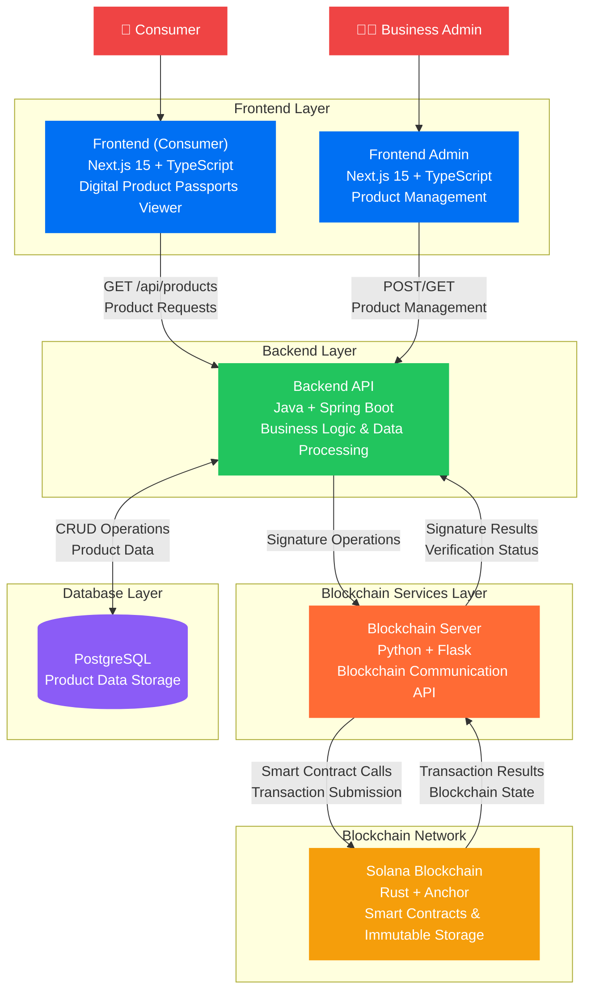

```mermaid
graph TB
    subgraph "Frontend Layer"
        FE["Frontend (Consumer)<br/>Next.js 15 + TypeScript<br/>Digital Product Passports Viewer"]
        FEA["Frontend Admin<br/>Next.js 15 + TypeScript<br/>Product Management"]
    end
    
    subgraph "Backend Layer"
        BE["Backend API<br/>Java + Spring Boot<br/>Business Logic & Data Processing"]
    end
    
    subgraph "Blockchain Services Layer"
        BCS["Blockchain Server<br/>Python + Flask<br/>Blockchain Communication API"]
    end
    
    subgraph "Blockchain Network"
        BC["Solana Blockchain<br/>Rust + Anchor<br/>Smart Contracts & Immutable Storage"]
    end
    
    subgraph "Database Layer"
        DB[("PostgreSQL<br/>Product Data Storage")]
    end
    
    %% User interactions
    CONSUMER["👤 Consumer"] --> FE
    ADMIN["👨‍💼 Business Admin"] --> FEA
    
    %% Frontend to Backend
    FE -->|"GET /api/products<br/>Product Requests"| BE
    FEA -->|"POST/GET<br/>Product Management"| BE
    
    %% Backend to Blockchain Services
    BE -->|"Signature Operations"| BCS
    BCS -->|"Signature Results<br/>Verification Status"| BE
    
    %% Blockchain Services to Blockchain
    BCS -->|"Smart Contract Calls<br/>Transaction Submission"| BC
    BC -->|"Transaction Results<br/>Blockchain State"| BCS
    
    %% Backend to Database
    BE <-->|"CRUD Operations<br/>Product Data"| DB
    
    %% Styling
    classDef frontend fill:#0070f3,color:#ffffff,stroke:#0070f3
    classDef backend fill:#22c55e,color:#ffffff,stroke:#22c55e
    classDef blockchain_service fill:#ff6b35,color:#ffffff,stroke:#ff6b35
    classDef blockchain fill:#f59e0b,color:#ffffff,stroke:#f59e0b
    classDef database fill:#8b5cf6,color:#ffffff,stroke:#8b5cf6
    classDef user fill:#ef4444,color:#ffffff,stroke:#ef4444
    
    class FE,FEA frontend
    class BE backend
    class BCS blockchain_service
    class BC blockchain
    class DB database
    class CONSUMER,ADMIN user


```
